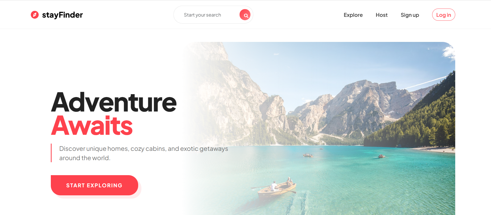
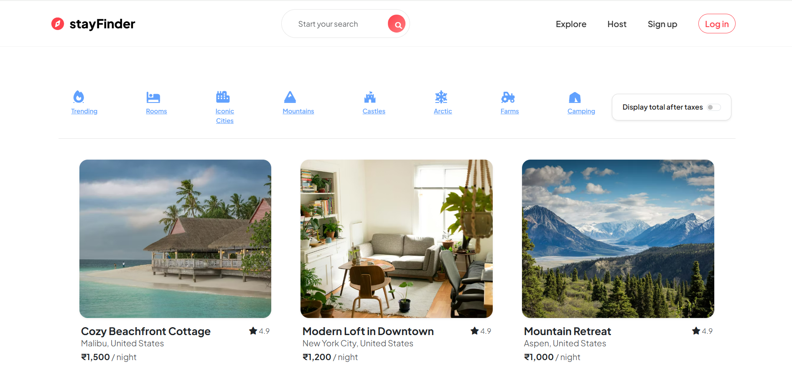
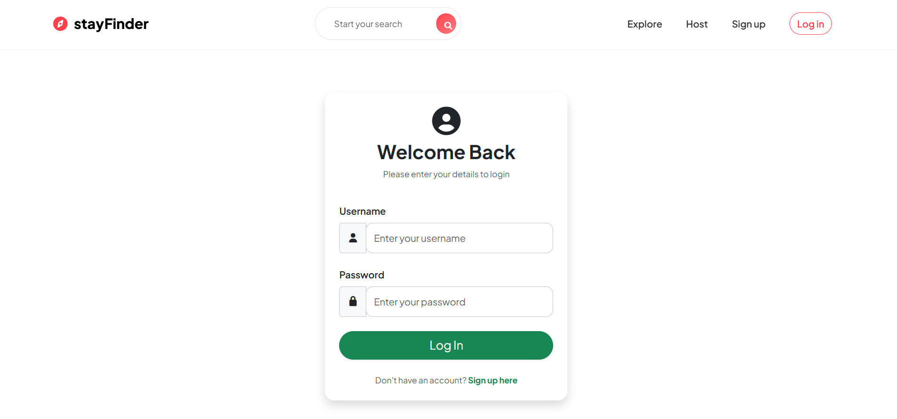

<p align="center">
  
</p>

<h1 align="center">🌍 stayFinder - A Stay Discovery Platform </h1>

<p align="center">
  <b>Discover unique stays. Host your world.</b>
</p>

<p align="center">
  
</p>

<p align="center">
  
  
  
  
</p>

<p align="center">
  
</p>

---


## 📌 Overview

**stayFinder** is a web-based travel accommodation platform that allows users to discover, list, and review unique stays.
It allows users to **explore, create, and manage property listings**, along with authentication and review systems.

Built with a powerful **Node.js + Express + MongoDB** stack, the app provides a seamless experience for both travelers and hosts.

---

## 📸 Screenshots





---

## 🚀 Features

✨ User Authentication (Signup / Login / Logout)  
🏠 Create, Edit, Delete Listings  
🔍 Search & Category Filtering  
📸 Image Upload via Cloudinary  
⭐ Review & Rating System  
🔐 Authorization (Owner & Review Protection)  
📊 Flash Messages for Feedback  
📱 Responsive UI with Bootstrap  
💾 Session Storage using MongoDB  

---

## 🛠️ Tech Stack

**Frontend:**
- EJS (Embedded JavaScript Templates)
- Bootstrap 5
- CSS Animations & Custom Styling

**Backend:**
- Node.js
- Express.js

**Database:**
- MongoDB (Mongoose ODM)

**Authentication:**
- Passport.js
- Passport-Local-Mongoose

**File Upload & Storage:**
- Multer
- Cloudinary

**Other Tools:**
- Joi (Validation)
- Express Session
- Connect-Mongo
- Method-Override

---

## ⚙️ Installation

### 1. Clone the repository

```bash
git clone https://github.com/Sachin23Pandey/stayFinder.git
cd stayFinder
```
### 2. Install dependencies

```bash
npm install
```
### 3. Setup Environment Variables

Create a .env file in the root directory:

```bash
ATLASDB_URL=your_mongodb_connection_string
CLOUD_NAME=your_cloudinary_name
CLOUD_API_KEY=your_cloudinary_key
CLOUD_API_SECERT=your_cloudinary_secret
SECRET=your_session_secret
```
### 4. Run the application
```bash
node app.js
```
---
## ➡️ Usage 

- Visit the homepage
- Sign up or log in
- Explore listings
- Create your own listing
- Add reviews & ratings
- Edit or delete your content
---
## 📂 Project Structure

```bash
stayFinder/
│
├── models/          # Mongoose schemas
├── routes/          # Express routes
├── controllers/     # Business logic
├── views/           # EJS templates
├── public/          # Static assets (CSS, JS)
├── middleware.js    # Custom middleware
├── utils/           # Helper functions
├── cloudConfig.js   # Cloudinary setup
├── app.js           # Main server file
└── package.json
```
## ⚠️ Disclaimer

This project is built for educational and portfolio purposes only.
It is not intended for production use without further improvements in security, scalability, and performance.

---
## 🔮 Future Plans

- 🚀 Add booking system
- 💳 Integrate payment gateway
- 🗺️ Map integration (Google Maps)
- Adding AI powered customer supporter 

---
## 🤝 Contribution & Feedback

Contributions are welcome!

If you would like to improve **`stayFinder`**:

- Fork the repository
- Create a new branch
- Make your changes
- Submit a Pull Request

Please open an issue first for major changes.

---
## 📜 License

This project is licensed under the MIT License.

---

<h2 align="center">🤝 Connect With Me</h2>

<p align="center">
  <b>💡 Let's connect, collaborate, and build something amazing together!</b>
</p>

<p align="center">
  <a href="https://linkedin.com/in/sachin-pandey-9455a7262" target="_blank">
    
  </a>
  
  <a href="https://x.com/Sachin23Pandey" target="_blank">
    
  </a>
  
  <a href="mailto:sachinpandey2423@gmail.com">
    
  </a>
</p>

---

<p align="center">
  
</p>

<p align="center">
  <b>⭐ If you like this project, consider giving it a star!</b>
</p>

<p align="center">
  
</p>

---
